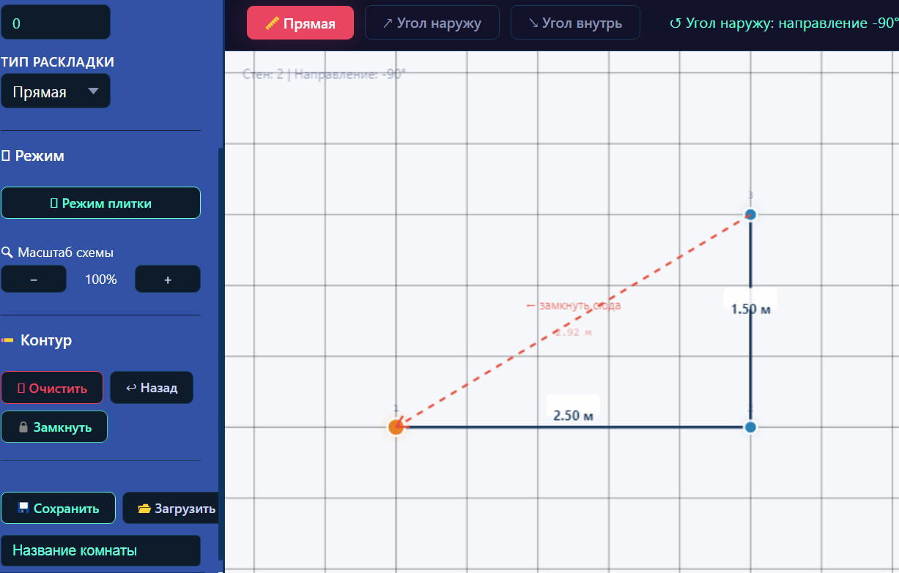
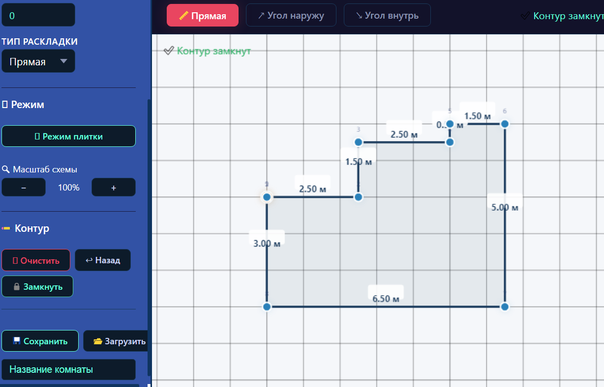
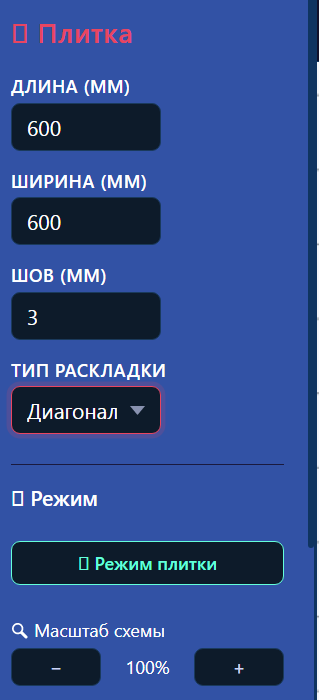
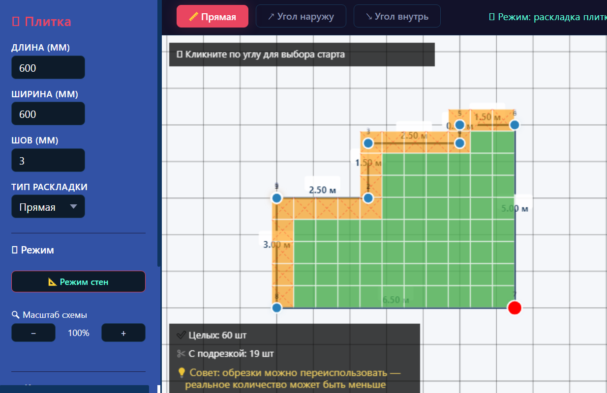
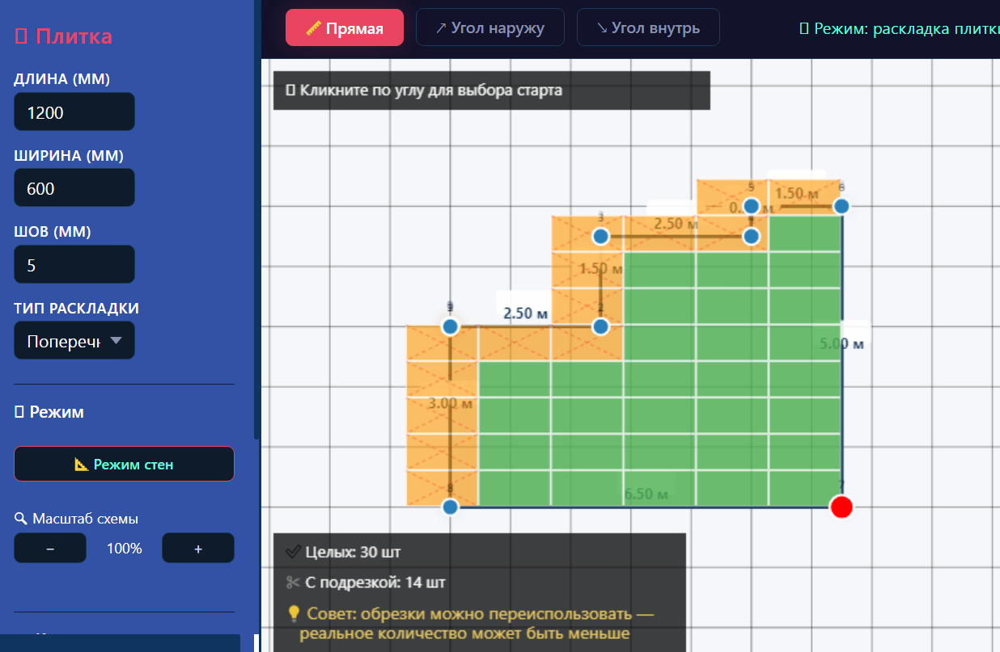
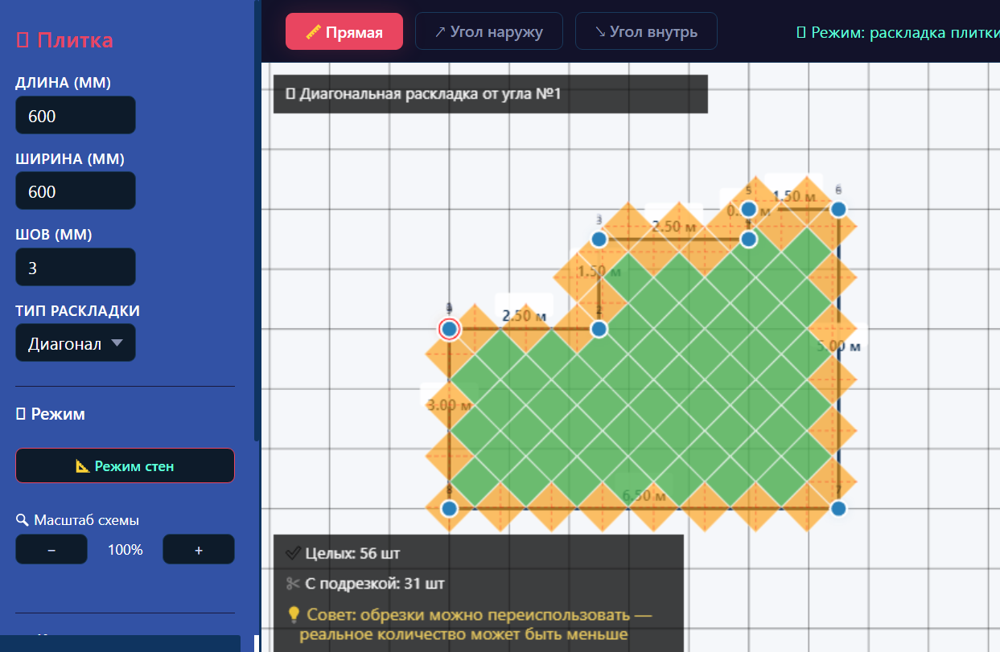

# 🧱 Tile Layout Planner

**Веб-инструмент для раскладки плитки на пол или стену.**

Рисуйте комнату любой формы, выбирайте тип раскладки, смотрите, как ляжет плитка, и считайте количество целых и резаных плиток.

🔗 **[Открыть онлайн](https://yvd230670-rgb.github.io/tile-layout-planner/)**

---

## ✨ Возможности

- 🏠 **Рисование комнаты любой формы** — прямые, углы внутрь/наружу.
- 🧱 **4 типа раскладки** — прямая, поперечная, диагональ, со смещением.
- 📐 **Учёт шва** — от 1 до 10 мм.
- 🎯 **Выбор стартового угла** — клик по любому углу комнаты.
- 💾 **Сохранение и загрузка** проектов в JSON.
- 👁️ **Наглядная визуализация** — целые плитки зелёные, резаные оранжевые.
- 🔍 **Масштабирование** схемы.
- 🧮 **Статистика** — количество целых и резаных плиток.

---

## 📸 Скриншоты

### 1. Рисование комнаты

### 2. Настройки плитки

### 3. Прямая раскладка (600×600)

### 4. Поперечная раскладка (600×300)

### 5. Диагональная раскладка

---

## 🚀 Как пользоваться

### Этап 1. Рисование комнаты

1. Нажми **«📏 Прямая»** — введи длину стены **в метрах**.
2. Нажми **«↗ Угол наружу»** или **«↘ Угол внутрь»** — повернуть на 90°.
3. Снова **«Прямая»** — рисуй следующую стену.
4. Когда обошёл всю комнату — нажми **«🔒 Замкнуть»**.

> 💡 **Горячие клавиши:** `Backspace` — отменить, `Esc` — очистить.

### Этап 2. Настройка плитки

1. Введи **Длину** и **Ширину** плитки в мм.
2. Введи **Шов** в мм (обычно 2–3 мм).
3. Выбери **тип раскладки**:
   - **Прямая** — плитка вдоль комнаты.
   - **Поперечная** — плитка повёрнута на 90°.
   - **Диагональ** — плитка под 45°.
   - **Со смещением** — как кирпичная кладка.

### Этап 3. Раскладка

1. Нажми **«🧱 Режим плитки»**.
2. **Кликни по углу** комнаты — от него начнётся раскладка.
3. Смотри статистику внизу слева:
   - ✅ **Целых** — количество целых плиток.
   - ✂️ **С подрезкой** — количество резаных.

> 💡 **Совет:** обрезки можно **переиспользовать** — реальное количество плитки может быть меньше.

### Этап 4. Сохранение

1. Введи **название комнаты**.
2. Нажми **«💾 Сохранить»** — скачается JSON.
3. Для загрузки — **«📂 Загрузить»** и выбери файл.

---

## 🎯 Пример 1: Квадратная плитка 600×600

**Комната 3×6 м, плитка 600×600, шов 2 мм.**

1. Рисуем комнату 3×6 м.
2. Настройки: Длина `600`, Ширина `600`, Шов `2`, Раскладка **Прямая**.
3. Режим плитки → **50 целых плиток**, 0 резаных.

---

## 🎯 Пример 2: Прямоугольная плитка 600×300

**Комната 3×6 м, плитка 600×300, шов 2 мм.**

1. Рисуем комнату 3×6 м.
2. Настройки: Длина `600`, Ширина `300`, Шов `2`, Раскладка **Поперечная**.
3. Режим плитки → **60 целых плиток**, 0 резаных.

**Сравни с прямой раскладкой:** при **поперечной** — 60 плиток, при **прямой** — 50. Выбирай, что выгоднее!

---

## ❓ Частые вопросы

### Плитка выходит за пределы контура — это нормально?

**Да.** Это **резаные** плитки (оранжевые с пунктиром). Они обрезаются по границе стены.

### Как понять, сколько плитки покупать?

Смотри статистику: **Целых + Резаных** = общее количество.

**Но!** Обрезки можно переиспользовать — реально может понадобиться меньше. **Совет:** добавь **10%** запаса на бой.

### Что делать, если комната сложной формы?

Рисуй её **поэтапно** — прямые + углы. Главное — **замкнуть контур**.

### Как уложить плитку от конкретной стены?

Кликни по **углу** этой стены — плитка начнётся от него.

---

## 📂 Структура проекта

tile-layout-planner/
├── index.html # Главная страница (или tile_layout.html)
├── app.js # Рисование стен
├── tiles.js # Логика раскладки плитки
├── save.js # Сохранение/загрузка
├── images/ # Скриншоты
└── README.md # Этот файл

## 🛠️ Технологии

- **HTML5 Canvas** — рисование.
- **Vanilla JavaScript** — без фреймворков.
- **CSS3** — тёмная тема.

---

## 🤝 Обратная связь

Нашли баг? Есть идея? Создайте **Issue**:
👉 [github.com/yvd230670-rgb/tile-layout-planner/issues](https://github.com/yvd230670-rgb/tile-layout-planner/issues)

---

## 📜 Лицензия

MIT — используйте свободно.

---

**Удачной укладки! 🧱🚀**